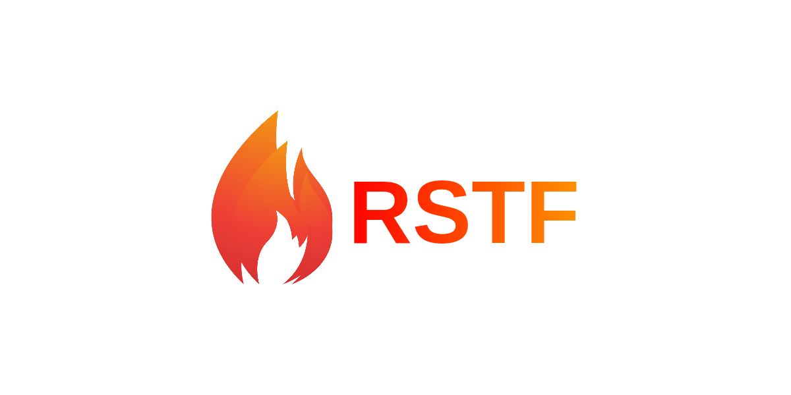

# 📦 RSTF (Rust Secure Transport Format)

[](https://github.com/warchs/rstf-rust/releases)
[](LICENSE)
[](https://github.com/warchs/rstf-rust/releases)
[](https://github.com/warchs/rstf-rust)

<div align="center">
  
</div>

**RSTF** is a high-performance file archiving utility built in Rust, prioritizing data security through modern encryption and efficient compression. It leverages cutting-edge cryptographic standards to safeguard files against emerging threats.

> Engineered for seamless cross-platform operation

---

## ⚡ Why RSTF?

Conventional archiving tools often employ outdated security measures vulnerable to contemporary attacks. **RSTF** stands out by integrating robust, forward-looking cryptography.

| Feature | 📦 RSTF (This Tool) | 🤐 7-Zip | 🗄️ ZIP |
| :--- | :--- | :--- | :--- |
| **Encryption** | **XChaCha20-Poly1305** (IETF Standard) | AES-256 | AES / ZipCrypto |
| **Key Derivation** | **Argon2id** (Memory-Hard) 🛡️ | PBKDF2 (Susceptible to GPU Attacks) | None / Weak |
| **Metadata** | **Fully Encrypted** 🔒 | Visible (Optional Encryption) | Visible |
| **Compression** | **Zstd** (Multithreaded) 🚀 | LZMA (Resource-Intensive) | Deflate |
| **Keyfile Support** | ✅ **Native** | ❌ No | ❌ No |
| **Mobile Native** | ✅ **Android/Termux Binary** | ❌ Requires App | ❌ Requires App |


---
## 📥 Installitation


### 📱 Android (Termux) Users
No root privileges required. Install the pre-compiled binary directly:

```bash
# 1. Download & Install
wget -q https://github.com/warchs/rstf-rust/releases/latest/download/rstf-android-aarch64 -O $PREFIX/bin/rstf

# 2. Make it executable
chmod +x $PREFIX/bin/rstf

# 3. Verify
rstf --version

# Help
rstf --help
```

### 🐧 Linux Users
Install system-wide:
```bash
# Download and install to /usr/local/bin
sudo wget -q https://github.com/warchs/rstf-rust/releases/latest/download/rstf-linux-amd64 -O /usr/local/bin/rstf

# Grant execution permissions
sudo chmod +x /usr/local/bin/rstf

# Verify
rstf --version

# Help
rstf --help
```


### 🍎 macOS Users
Compatible with Intel and Apple Silicon (via Rosetta).
```bash
# Download and install to /usr/local/bin
sudo wget -q https://github.com/warchs/rstf-rust/releases/latest/download/rstf-macos-amd64 -O /usr/local/bin/rstf

# Grant execution permissions
sudo chmod +x /usr/local/bin/rstf

# Verify
rstf --version

# Help
rstf --help
```

### 💻 Windows Users
1. Download `rstf-windows-amd64.exe` from the [Release Page](https://github.com/warchs/rstf-rust/releases).

2. Open Command Prompt or PowerShell in the download folder.

3. Run: `.\rstf-windows-amd64.exe --help`
   (Optional: Add the folder to your PATH for easier access).

### 📖 Usage Guide
1. **🔒 Pack (Encrypt & Compress)**
   Securely archive files or directories.
   ```bash
   # Basic usage (Prompts for password securely)
   rstf pack ./sensitive_data

   # Advanced Mode (Maximum compression + Keyfile + Wipe originals)
   rstf pack ./important_file.db --level 22 --wipe -k ./key_image.jpg
   ```
   > Note: The --wipe flag securely deletes source files after successful archiving.

2. **🔓 Unpack (Decrypt & Extract)**
   Restore archived data. Provide the password (and keyfile if used).
   ```bash
   # Basic unpack
   rstf unpack ./sensitive_data.rstf

   # Unpack with Keyfile
   rstf unpack ./important_file.rstf -k ./key_image.jpg
   ```

3. **📜 List Contents**
   View archive contents without extraction. Credentials are needed since metadata is encrypted.
   ```bash
   rstf list ./backup.rstf
   ```

### 🛠️ Technical Details
RSTF implements an **Encrypt-then-MAC** approach using modern cryptographic primitives:
* **Compression: Zstd** (Levels 1-22). Processes data in 64KB chunks for efficient memory use.
* **KDF (Key Derivation): Argon2id** (Version 19). Increases resistance to brute-force by demanding high computational and memory resources, countering GPU clusters.
* **Encryption: XChaCha20-Poly1305**. A performant authenticated stream cipher.
* **Randomness:** Relies on the OS's cryptographically secure random number generator (via the rand crate) for salts and nonces.

### ⚠️ Important Security Notice
**This software contains no backdoors.** Loss of your password or keyfile will make data irrecoverable. RSTF's cryptography is designed to resist brute-force attacks. Always secure backups and use strong, unique passwords.

### 👤 Author
**William Nathanael** (warchs)  
* Independent Developer and Cybersecurity Enthusiast  
* This README and the entire project were manually crafted by a human developer, drawing from personal experience in Rust programming and cryptography. No automated tools, bots, or AI were used in its creation to ensure authenticity and originality.  
* [GitHub Profile](https://github.com/warchs)  
* [Personal Website]()  

### 📄 License
This project is licensed under the MIT License - see the [LICENSE](LICENSE) file for details.  
